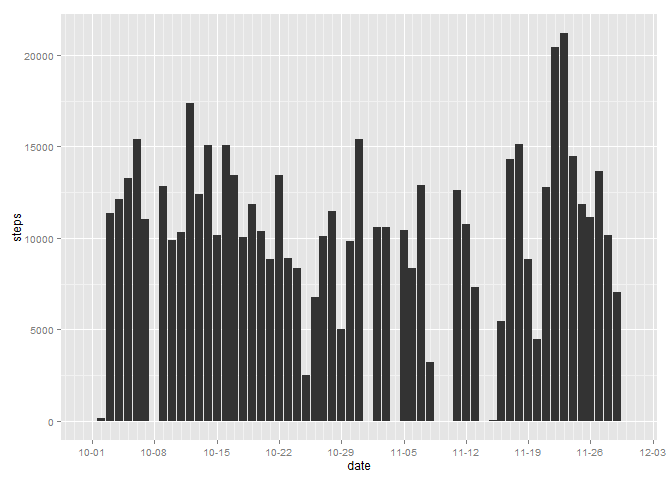
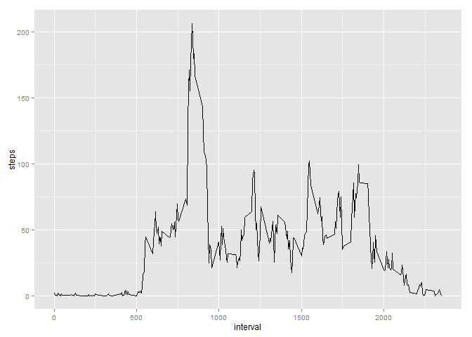
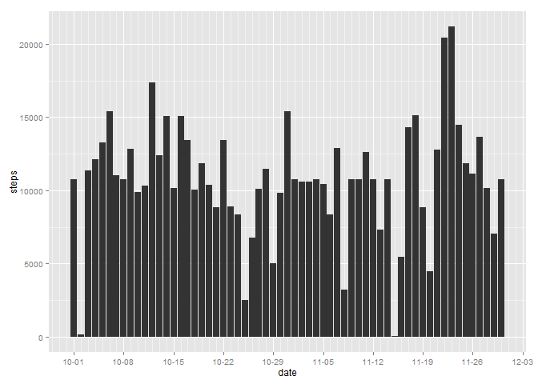
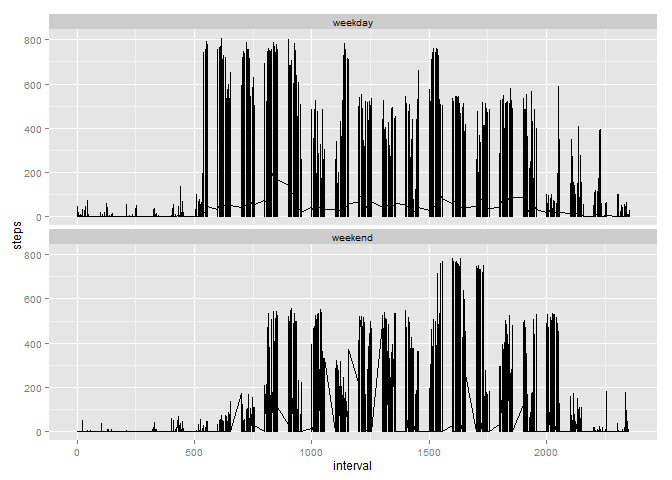

# Reproducible Research: Peer Assessment 1


## 1. Loading and preprocessing the data
Start by loading up the data.  
Loading library **dplyr**, **ggplot2** and **scales**.  

```r
library(dplyr)
library(ggplot2)
library(scales)
data <- read.csv("./activity.csv", stringsAsFactors = FALSE)
data <- mutate(data, date = as.Date(data$date, "%Y-%m-%d"))
```

-------------------------

## 2. What is mean total number of steps taken per day?
Prepare the data by group using **date**
then calculate sum of steps taken each day

```r
dataGroupByDate <- group_by(data, date)
sumStepByDate <- summarise_each(dataGroupByDate, funs(sum(., na.rm = TRUE)))
```
### Plot the average number of steps taken per day. 

```r
sumStepByDate$date <- as.POSIXlt(sumStepByDate$date)
g <- ggplot(sumStepByDate, aes(date, steps))
g <- g + geom_histogram(stat="identity")
g <- g + scale_x_datetime(labels = date_format("%m-%d"),breaks = date_breaks(width="1 week"),minor_breaks = date_breaks(width = "1 day"))
png(filename = "./figure/plot1.png", width = 672, height = 480)
print(g)
dev.off()
```



### Calculate and report the mean and median total number of steps taken per day.

#### Mean of steps taken per day.

```r
print(mean(sumStepByDate$steps))
```

```
## [1] 9354.23
```
#### Median of steps taken per day.

```r
print(median(sumStepByDate$steps))
```

```
## [1] 10395
```

----------

## 3. What is the average daily activity pattern?
To answer this question we will calculate average steps by **interval**.  
Group data up by interval, then plot it out using ggplot2.  

```r
dataGroupByInterval <- group_by(data, interval)
## select only column that we want to summarise.
dataGroupByInterval <- dataGroupByInterval[,c(1,3)]
## summarise the data and create another data frame to plot.
aveStepsByInterval <- summarise_each(dataGroupByInterval, funs(mean(., na.rm=TRUE)))
g2 <- ggplot(aveStepsByInterval, aes(interval, steps))
g2 <- g2 + geom_line()
png(filename = "./figure/plot2.png", width = 672, height = 480)
print(g2)
dev.off()
```



### Which 5-minute interval, on average across all the days in the dataset, contains the maximum number of steps?


```r
print(top_n(aveStepsByInterval, n=1))
```

```
## Source: local data frame [1 x 2]
## 
##   interval    steps
## 1      835 206.1698
```
The 835 interval is **8.35 AM **

## 4. Imputing missing values

### Total number of missing values in the dataset.


```r
print(sum(is.na(data$steps)))
```

```
## [1] 2304
```

### I decide to fill the missing data with average number of that interval.

```r
## start by copy data to another dataset
filledData <- data
## using aveStepsByInterval dataset to fill NA data with average steps of that time interval
filledData <- cbind(filledData, averagesteps = aveStepsByInterval$steps)
filledData <- mutate(filledData, steps = ifelse(is.na(steps), averagesteps, steps))
```

### Histogram of the total number of steps taken each day.


```r
dataGroupByDate2 <- group_by(filledData, date)
sumStepByDate2 <- summarise_each(dataGroupByDate2, funs(sum(., na.rm = TRUE)))
sumStepByDate2$date <- as.POSIXlt(sumStepByDate2$date)

g3 <- ggplot(sumStepByDate2, aes(date, steps))
g3 <- g3 + geom_histogram(stat="identity")
g3 <- g3 + scale_x_datetime(labels = date_format("%m-%d"),breaks = date_breaks(width="1 week"),minor_breaks = date_breaks(width = "1 day"))
png(filename = "./figure/plot3.png", width = 672, height = 480)
print(g3)
dev.off()
```



#### Mean and Median of the imputing data.


```r
print(mean(sumStepByDate2$steps))
```

```
## [1] 10766.19
```

```r
print(median(sumStepByDate2$steps))
```

```
## [1] 10766.19
```

###Q. Do these values differ from the estimates from the first part of the assignment? 

#### Mean and Median of original data.

```r
print(mean(sumStepByDate$steps))
```

```
## [1] 9354.23
```

```r
print(median(sumStepByDate$steps))
```

```
## [1] 10395
```

#### Mean and Median of imputing data.

```r
print(mean(sumStepByDate2$steps))
```

```
## [1] 10766.19
```

```r
print(median(sumStepByDate2$steps))
```

```
## [1] 10766.19
```

**A. From the data that shown above we can see that the mean and median is different from each other, the results from imputing data are higher and mean and median has the same exact number.**

###Q. What is the impact of imputing missing data on the estimates of the total daily number of steps?

**A. Mean and Median of the imputing data is the same exact number.**


----------------------------------------------------------

## 5. Q. Are there differences in activity patterns between weekdays and weekends?

To answer this question we will add column into our imput data contain **weekday** and **weekend**.  
Then use that to plot two different figures.


```r
##clone the data to add day of week
dataWithDays <- filledData
## Create another column contain the day of the week.
dataWithDays$weekdays <- weekdays(dataWithDays$date)
##mutate weekdays column to weekday and weekend
dataWithDays <- mutate(dataWithDays, 
                       weekdays = ifelse(weekdays == "Saturday" | weekdays == "Sunday", 
                       "weekend", 
                       "weekday"))
##plot by ggplot2
g4 <- ggplot(dataWithDays, aes(interval,steps))
g4 <- g4 + geom_line() + facet_wrap(~weekdays, ncol=1)
png(filename = "./figure/plot4.png", width = 672, height = 480)
print(g4)
dev.off()
```



**A. from the two figures, we can see that weekday activity pattern tend to start in earlier hours, this might be to the fact that the test subject was going to work. While the weekend pattern tend to start in later hour but have more activity in the afternoon.**


